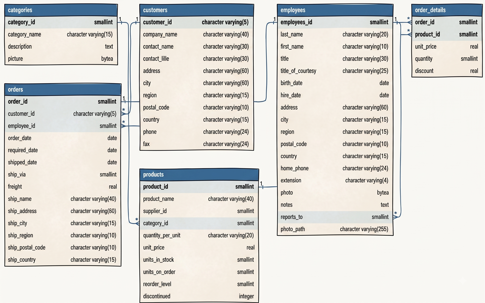
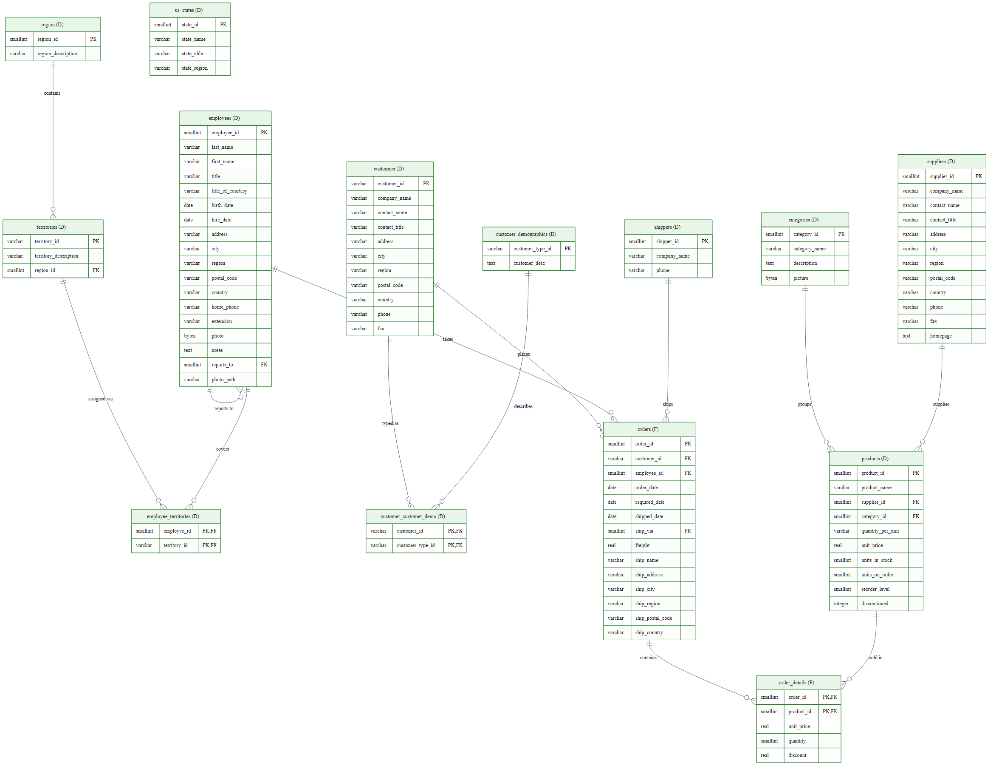

# Northwind Traders — SQL Window Functions & CTE Project

## 🎯 Overview

A hands-on data analysis project using the **Northwind Traders** database - an
international gourmet food distributor - to practice **PostgreSQL window functions and
Common Table Expressions (CTEs)** on real-world sales data. This project demonstrates
both **Data Engineering** (setting up a database) and **Data Analysis** (turning data
into business decisions) skills.

This project focuses on the rich Northwind database, which provides a real-world-like
platform for exploring and analyzing sales data. It broadens understanding and
application of window functions, CTEs, and other advanced SQL techniques.

---

## 🚀 Objectives

By the end of this project you can:

- **Understand** the logic behind window functions and CTEs and their applications in
  real-world scenarios.
- **Construct** SQL queries that use window functions and CTEs to solve complex data
  analysis tasks.
- **Analyze and interpret** the results of these queries to drive data-informed
  decisions.
- **Calculate** running totals, compute averages, rank items, and analyze growth rates.

---

## 🏢 Business Scenario

**You are a Data Analyst at Northwind Traders, an international gourmet food
distributor.** Management is looking to you for insights to make strategic decisions.
This project tackles four business questions:

| # | Business problem | Business decision supported |
|---|------------------|-----------------------------|
| 1 | Evaluating **employee performance** | Boost productivity |
| 2 | Understanding **product & category performance** | Optimize inventory & marketing |
| 3 | Analyzing **sales growth** | Identify trends, monitor progress, forecast |
| 4 | Evaluating **customer purchase behavior** | Target high-value customers with promos |

---

## 🗄️ Database Schema

We keep **two diagrams** at hand — they answer different questions:

| Diagram | When to look at it |
|---|---|
|  | Writing queries — know exact column names, data types, and FK arrows. |
|  | Understanding the **data model** — which tables are facts (events you measure) vs. dimensions (descriptive context). |

> ⚠️ **A small data-modeling note (and why we have two diagrams):**
> the `schema-northwind-traders.png` is the **normalized source schema** (3NF).
> `erd-northwind.png` is the **dimensional model** we derive from it — a **star /
> snowflake schema** with:
> - **Fact tables** (the `F` markers): `orders`, `order_details` — the measurable
>   events (an order placed, a line item sold).
> - **Dimension tables** (the `D` markers): `customers`, `employees`, `products`,
>   `categories`, `suppliers`, `shippers`, `territories`, `region`, `us_states` —
>   the descriptive context we slice the facts by.
>
> Going from a normalized schema to a fact/dim ERD is **dimensional modeling**
> (the Kimball flavor used in data warehouses). Every one of our 4 business
> questions becomes a JOIN from a fact table to one or more dimensions:

| # | Business question | Fact table | Dimensions joined |
|---|---|---|---|
| 1 | Employee performance | `orders`, `order_details` | `employees` |
| 2 | Product & category performance | `order_details` | `products`, `categories` |
| 3 | Sales growth (over time) | `orders`, `order_details` | (date columns on the facts) |
| 4 | Customer purchase behavior | `orders`, `order_details` | `customers` |

> The main tables used in this project are: `employees`, `orders`, `order_details`,
> `products`, `categories`, and `customers`.

---

## 🧱 Data Model — How We Modeled It (Dimensional Modeling in 4 Steps)

Before writing a single analytic query, we modeled the data the way a data engineer
would for a warehouse: **pick the process → declare the grain → identify dimensions
→ identify measures**. This is the [Kimball-style 4-step process](https://www.kimballgroup.com/data-warehouse-business-intelligence-resources/kimball-techniques/dimensional-modeling-techniques/)
for designing a star schema.

### Step 1 — Select the Business Process

> *"One business process per star schema."*

We chose **sales** (customers buying products through Northwind). Not shipments,
not inventory restocking, not marketing campaigns — **sales** is the only process
whose grain lets us answer all four management questions above. Other processes
(shipping, inventory) would get their own stars, joined through conformed
dimensions — but they are out of scope for this project.

| # | Business question | Answerable by the sales process? |
|---|---|---|
| 1 | Employee performance | ✅ Revenue per salesperson |
| 2 | Product & category performance | ✅ Revenue per SKU / category |
| 3 | Sales growth | ✅ Revenue per month, year-over-year |
| 4 | Customer purchase behavior | ✅ Revenue per customer, repeat purchases |

### Step 2 — Declare the Grain

> *"When in doubt, go with the most granular level that makes business sense.
> You can always aggregate up, but you can't drill down into data that doesn't exist."*

**Grain = one row in `order_details` = one product sold inside one order.**
**Grain key = `(order_id, product_id)`.**

If a customer buys 3 different products in one order → **3 rows** in
`order_details`. If they buy 5 units of the same product → **1 row** with
`quantity = 5`.

We **verify the grain** in `eda-northwind-traders.ipynb` with:

```sql
SELECT order_id, product_id, COUNT(*) AS n
FROM order_details
GROUP BY order_id, product_id
HAVING COUNT(*) > 1;
```

Returns 0 rows ✅ — every `(order_id, product_id)` pair is unique, the grain holds.

**Why not one row per order?** We would lose the ability to analyze revenue by
product, category, or any product-level dimension — which is question #2.
**Why not one row per unit sold?** Quantity wouldn't be additive across rows;
revenue would be inflated by a factor of `quantity`.

### Step 3 — Identify the Dimensions

> *"Wide and denormalized. 10–50+ columns in a dimension is normal and expected."*

For each fact row, what descriptive context surrounds the event?

| Dimension | Question it answers | Source table(s) | Key attributes we use |
|---|---|---|---|
| `dim_date` | *When?* | (would build: a static table of 1996–1998 calendar attributes) | `full_date`, `month`, `quarter`, `year`, `day_of_week` |
| `dim_customer` | *Who bought?* | `customers` | `company_name`, `country`, `city`, `contact_name` |
| `dim_employee` | *Who sold?* | `employees` | `first_name`, `last_name`, `title`, `hire_date` |
| `dim_product` | *What?* | `products` (snowflaked via `categories`) | `product_name`, `category_name`, `unit_price`, `discontinued` |
| `dim_category` | *Which product group?* | `categories` | `category_name`, `description` |
| `dim_shipper` | *How shipped?* | `shippers` | `company_name` |

**Note:** Northwind is a **snowflake**, not a pure star — `dim_product` has a
foreign key to `dim_category` (a separate table). For analytics this doesn't
matter; we just add one extra JOIN. In a true Kimball star, we would
**denormalize** `category_name` directly into `products`.

**Note:** We don't have a `dim_promotion` table — `discount` is just a
numeric column on the fact. We can analyze *how much* discount, but not
*which campaign* drove it.

### Step 4 — Identify the Facts (Measures)

> *"Additive measures can be summed across all dimensions. Non-additive can't be
> summed meaningfully — you can average them, but not sum."*

| Measure | Formula | Type | Additive across all dims? |
|---|---|---|---|
| `quantity` | `od.quantity` | Additive | ✅ Yes |
| `unit_price` | `od.unit_price` | Non-additive | ❌ Sum is meaningless; we AVG |
| `discount` | `od.discount` | Non-additive (it's a rate, 0–1) | ❌ We AVG |
| `gross_revenue` | `unit_price × quantity` | Additive | ✅ Yes |
| `net_revenue` | `unit_price × quantity × (1 − discount)` | Additive | ✅ Yes — our canonical "revenue" |

### The mental model before every query

Before writing any analytic SQL, we ask four questions:

1. **What's my fact?** → `order_details` (the event table)
2. **What's my grain?** → one row = one product sold in one order
3. **Which dimensions do I slice by?** → who/what/when/where joins
4. **Is my measure additive at this grain?** → can I `SUM` it freely

If we can answer all four, the query is well-formed. This is the discipline
that separates a random `SELECT` from a properly modeled analytic query.

---

## 🧰 Tech Stack

| Layer | Tool |
|-------|------|
| Database | PostgreSQL 17 (Docker image `postgres:17-alpine`) |
| Containers | Docker + Docker Compose |
| GUI (manage DB) | pgAdmin 4 (`http://localhost:5050`) — browse schema, save `.sql` |
| Exploration | Jupyter Notebook + `psycopg` + `pandas` (port `55432`) |
| CLI | `psql` inside the container |

## 🧭 Workflow Split

- **pgAdmin** is for *managing* the database (browsing tables, the ER diagram,
  saving `.sql` scripts, ad-hoc inspection).
- **Jupyter notebook** (`eda-northwind-traders.ipynb`) is for *exploring* the data:
  write SQL inside Python cells, get results as pandas DataFrames, iterate quickly.
- Both point at the **same Dockerized PostgreSQL** — they don't conflict.

---

## 📁 Repository Structure

```
sql-northwind-traders/
├── README.md               # This portfolio summary
├── docker-compose.yml      # PostgreSQL + pgAdmin containers (from source repo)
├── northwind.sql           # Schema + sample data seed script (from source repo)
├── exploration.ipynb       # (legacy) early exploration notebook (psycopg + pandas)
├── eda-northwind-traders.ipynb  # Active notebook — exploration + grain + analytic queries
├── img/
│   └── schema-northwind-traders.png   # ER diagram
├── queries.sql             # [Final deliverable] explained queries (window fns + CTEs)
└── analysis.md             # [Final deliverable] insights written for management
```

---

## 🧭 How We Built It — The Process

1. **Plan (problem-first):** Defined the four business questions before writing any SQL
   (`plan.md`).
2. **Set up the database (DE):** Used Docker Compose to run PostgreSQL, auto-seeded
   with Northwind data, and explored the schema (tables, keys, relationships).
3. **Query & analyze (DA):** Progressed from SQL basics (JOINs, GROUP BY) to advanced
   **window functions and CTEs** — ranking, running totals, moving averages, and growth
   with `LAG`/`LEAD` — each mapped to a real business question.
4. **Deliver insights:** Documented findings in `analysis.md` as a report to management.

---

## 🧠 Key SQL Techniques Practiced

- `WITH` (Common Table Expressions / CTEs) for readable, modular queries.
- Window functions:
  - `ROW_NUMBER()`, `RANK()`, `DENSE_RANK()` — ranking
  - `SUM() OVER (PARTITION BY ...)` — running totals & category shares
  - `AVG() OVER (ORDER BY ... ROWS BETWEEN ...)` — moving averages
  - `LAG()` / `LEAD()` — month-over-month growth & forecasts
- Combining multiple window functions with CTEs for complex analysis.

---

## ✅ Status

| Phase | Deliverable | Status |
|-------|-------------|--------|
| Plan | `plan.md` | ✅ Done |
| Diary | `diary.md` | 🟡 In progress (updated each session) |
| DB setup | Containers running, schema + data loaded | ✅ Done (14 tables; see diary) |
| Exploration | `eda-northwind-traders.ipynb` | 🟡 In progress |
| Core queries | `queries.sql` | ⬜ Pending |
| Final insights | `analysis.md` | ⬜ Pending |

---

## 🔗 References

- Northwind for PostgreSQL (DB seed): https://github.com/pthom/northwind_psql
- PostgreSQL window functions: https://www.postgresql.org/docs/current/tutorial-window.html

---
